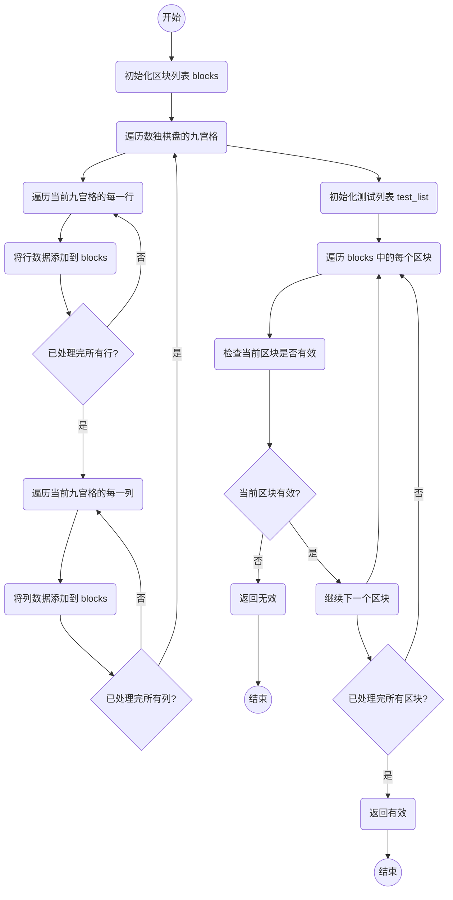

# 实验五 Python数据结构与数据模型

班级： 21计科1

学号： 20210302103

姓名： 刘阳阳

Github地址：<https://github.com/last-xuan-official/python->

CodeWars地址：<https://www.codewars.com/users/last-xuan-official>

---

## 实验目的

1. 学习Python数据结构的高级用法
2. 学习Python的数据模型

## 实验环境

1. Git
2. Python 3.10
3. VSCode
4. VSCode插件

## 实验内容和步骤

### 第一部分

在[Codewars网站](https://www.codewars.com)注册账号，完成下列Kata挑战：

---

#### 第一题：停止逆转我的单词

难度： 6kyu

编写一个函数，接收一个或多个单词的字符串，并返回相同的字符串，但所有5个或更多的字母单词都是相反的（就像这个Kata的名字一样）。传入的字符串将只由字母和空格组成。只有当出现一个以上的单词时，才会包括空格。
例如：

```python
spinWords( "Hey fellow warriors" ) => returns "Hey wollef sroirraw" 
spinWords( "This is a test") => returns "This is a test" 
spinWords( "This is another test" )=> returns "This is rehtona test"
```

代码提交地址：
<https://www.codewars.com/kata/5264d2b162488dc400000001>

提示：

- 利用str的split方法可以将字符串分为单词列表
例如：

```python
words = "hey fellow warrior".split()
# words should be ['hey', 'fellow', 'warrior']
```

- 利用列表推导将长度大于等于5的单词反转(利用切片word[::-1])
- 最后使用str的join方法连结列表中的单词。

---

```python
def spin_words(sentence):
    word_list = sentence.split()
    for index,word in enumerate(word_list) :
        if len(word) >= 5:
            word_list[index]=word[::-1]
            
    return ' '.join(word_list)
```

-解析：使用enumerate函数获取枚举从而同时获得键值

#### 第二题： 发现离群的数(Find The Parity Outlier)

难度：6kyu

给你一个包含整数的数组（其长度至少为3，但可能非常大）。该数组要么完全由奇数组成，要么完全由偶数组成，除了一个整数N。请写一个方法，以该数组为参数，返回这个 "离群 "的N。

例如：

```python
[2, 4, 0, 100, 4, 11, 2602, 36]
# Should return: 11 (the only odd number)

[160, 3, 1719, 19, 11, 13, -21]
# Should return: 160 (the only even number)
```

代码提交地址：
<https://www.codewars.com/kata/5526fc09a1bbd946250002dc>

---

```python
def find_outlier(integers):
    odd_list = [i for i in integers if i % 2]
    even_list = [i for i in integers if i % 2 == 0]
    
    return odd_list[0] if len(odd_list) == 1 else even_list[0]
```

-解析：统计数量，为一的为要输出的

#### 第三题： 检测Pangram

难度：6kyu

pangram是一个至少包含每个字母一次的句子。例如，"The quick brown fox jumps over the lazy dog "这个句子就是一个pangram，因为它至少使用了一次字母A-Z（大小写不相关）。

给定一个字符串，检测它是否是一个pangram。如果是则返回`True`，如果不是则返回`False`。忽略数字和标点符号。
代码提交地址：
<https://www.codewars.com/kata/545cedaa9943f7fe7b000048>

---

```python
def is_pangram(s):
    d = {}
    for character in s.lower():
        if character not in d and 'a' <= character <='z':
            d[character] = 1
    print(d)
    return True if len(d) == 26 else False
```

-解析:将串转换为小写后统计各字母是否出现过即可

#### 第四题： 数独解决方案验证

难度：6kyu

数独背景

数独是一种在 9x9 网格上进行的游戏。游戏的目标是用 1 到 9 的数字填充网格的所有单元格，以便每一列、每一行和九个 3x3 子网格（也称为块）中的都包含数字 1 到 9。更多信息请访问：<http://en.wikipedia.org/wiki/Sudoku>

编写一个函数接受一个代表数独板的二维数组，如果它是一个有效的解决方案则返回 true，否则返回 false。数独板的单元格也可能包含 0，这将代表空单元格。包含一个或多个零的棋盘被认为是无效的解决方案。棋盘总是 9 x 9 格，每个格只包含 0 到 9 之间的整数。

代码提交地址：
<https://www.codewars.com/kata/63d1bac72de941033dbf87ae>

---

```python
def validate_sudoku(board):
    blocks = [[board[x+a][y+b] for a in (0, 1, 2) for b in (0, 1, 2)] for x in (0, 3, 6) for y in (0, 3, 6)]
    for row_list in board:
        blocks.append(row_list)
    
    for column in range(len(board[0])):
        column_data = [row[column] for row in board]
        blocks.append(column_data)
    
    
    test_list=set(range(1,10))
    for l in blocks:
        if set(l) != test_list:
            return False
    
    return True
```

#### 第五题： 疯狂的彩色三角形

难度： 2kyu

一个彩色的三角形是由一排颜色组成的，每一排都是红色、绿色或蓝色。连续的几行，每一行都比上一行少一种颜色，是通过考虑前一行中的两个相接触的颜色而产生的。如果这些颜色是相同的，那么新的一行就使用相同的颜色。如果它们不同，则在新的一行中使用缺失的颜色。这个过程一直持续到最后一行，只有一种颜色被生成。

例如：
```python
Colour here:            G G        B G        R G        B R
Becomes colour here:     G          R          B          G
```


一个更大的三角形例子：

```python
R R G B R G B B
 R B R G B R B
  G G B R G G
   G R G B G
    B B R R
     B G R
      R B
       G
```

你将得到三角形的第一行字符串，你的工作是返回最后的颜色，这将出现在最下面一行的字符串。在上面的例子中，你将得到 "RRGBRGBB"，你应该返回 "G"。
限制条件： 1 <= length(row) <= 10 ** 5
输入的字符串将只包含大写字母'B'、'G'或'R'。

例如：

```python
triangle('B') == 'B'
triangle('GB') == 'R'
triangle('RRR') == 'R'
triangle('RGBG') == 'B'
triangle('RBRGBRB') == 'G'
triangle('RBRGBRBGGRRRBGBBBGG') == 'G'
```

代码提交地址：
<https://www.codewars.com/kata/5a331ea7ee1aae8f24000175>

提示：请参考下面的链接，利用三进制的特点来进行计算。
<https://stackoverflow.com/questions/53585022/three-colors-triangles>

```python
MAX_N_LOG_3 = 32

def conv_base_3(n, max, out):
    i = 0
    while i < max and n > 0:
        out[i] = n % 3
        n //= 3
        i += 1
    return i

def binom_max_2(n, k):
    if n < k:
        return 0
    if n in (0, 1):
        return 1
    if n == 2:
        return 1 + int(k == 1)
    return 0

def lucas_3(len_n, dig_n, len_k, dig_k):
    prod = 1
    for i in range(len_n):
        n_i = dig_n[i]
        k_i = dig_k[i] if i < len_k else 0
        prod = (prod * binom_max_2(n_i, k_i)) % 3
    return prod % 3

def int_2_char(i):
    return 'RGB'[i]

def char_2_int(c):
    return {'R': 0, 'G': 1, 'B': 2}.get(c, 3)

def triangle(input):
    sum_val = 0
    n = len(input)
    dig_n = [0] * MAX_N_LOG_3
    len_n = conv_base_3(n - 1, MAX_N_LOG_3, dig_n)
    
    for km1 in range(n):
        dig_k = [0] * MAX_N_LOG_3
        len_k = conv_base_3(km1, MAX_N_LOG_3, dig_k)
        
        Cnk_mod3 = lucas_3(len_n, dig_n, len_k, dig_k)
        sum_val = (sum_val + Cnk_mod3 * char_2_int(input[km1])) % 3
    
    sign = (n % 2) * 2 - 1
    sum_mod3 = (3 + (sign * (sum_val % 3))) % 3
    return int_2_char(sum_mod3)

```

- 解析如下：

        binom_max_2(n, k) 函数用于计算二项式系数 C(n, k)，但取模 3 后的结果。

        lucas_3(n, k) 函数使用动态规划计算组合数 C(n, k)，并对结果取模 3。这个函数存储了计算过程中的中间结果，以避免重复计算。

        int_2_char(i) 函数将整数转换为字符 'R'、'G' 或 'B'。

        triangle(input) 函数是主要的计算部分。它遍历输入字符串的每个字符，将其映射为相应的数值，然后根据一些组合运算规则计算结果，并返回一个字符。

        整个算法的时间复杂度主要受影响的部分是 lucas_3(n, k) 函数的动态规划部分。这部分的时间复杂度是O(n^2)，因为它使用一个二维数组来存储中间结果。

---

### 第二部分

使用Mermaid绘制程序流程图



## 实验过程与结果


代码运行结果的文本可以直接粘贴在这里。

**注意：不要使用截图，因为Markdown文档转换为Pdf格式后，截图会无法显示。**

## 实验考查

请使用自己的语言并使用尽量简短代码示例回答下面的问题，这些问题将在实验检查时用于提问和答辩以及实际的操作。

1. 集合（set）类型有什么特点？它和列表（list）类型有什么区别？

        集合是一种无序且不允许重复元素的数据类型，而列表是有序且允许重复元素的数据类型。

2. 集合（set）类型主要有那些操作？

        
        方法	描述
        add()	为集合添加元素
        clear()	移除集合中的所有元素
        copy()	拷贝一个集合
        difference()	返回多个集合的差集
        difference_update()	移除集合中的元素，该元素在指定的集合也存在。
        discard()	删除集合中指定的元素
        intersection()	返回集合的交集
        intersection_update()	返回集合的交集。
        isdisjoint()	判断两个集合是否包含相同的元素，如果没有返回 True，否则返回 False。
        issubset()	判断指定集合是否为该方法参数集合的子集。
        issuperset()	判断该方法的参数集合是否为指定集合的子集
        pop()	随机移除元素
        remove()	移除指定元素
        symmetric_difference()	返回两个集合中不重复的元素集合。
        symmetric_difference_update()	移除当前集合中在另外一个指定集合相同的元素，并将另外一个指定集合中不同的元素插入到当前集合中。
        union()	返回两个集合的并集
        update()	给集合添加元素

3. 使用`*`操作符作用到列表上会产生什么效果？为什么不能使用`*`操作符作用到嵌套的列表上？使用简单的代码示例说明。

使用*操作符可以重复列表元素，但不能用于嵌套列表。示例：

```python
list1 = [1, 2, 3]
list2 = list1 * 2  # 重复元素，list2为 [1, 2, 3, 1, 2, 3]
nested_list1 = [[1, 2], [3, 4]]
nested_list2 = nested_list1 * 2 # error!

```

Python中，*操作符用于重复列表中的元素，但它不会递归地复制嵌套列表中的元素。这是因为*操作符的主要目的是将列表中的元素复制多次，而不是创建深层次的副本。
当使用*操作符作用于嵌套列表时，它只会复制对嵌套列表的引用，而不会创建独立的副本。这意味着，如果您更改其中一个嵌套列表的元素，其他引用它的地方也会受到影响，因为它们指向相同的内存位置。

4. 总结列表,集合，字典的解析（comprehension）的使用方法。使用简单的代码示例说明。

## 列表解析

### 从1到10创建一个平方数列表

squares = [x**2 for x in range(1, 11)]

### 选择列表中的偶数

even_numbers = [x for x in range(1, 11) if x % 2 == 0]

## 集合解析

### 创建包含数字1到10的集合

my_set = {x for x in range(1, 11)}

### 从列表中创建包含不重复元素的集合

numbers = [1, 2, 2, 3, 4, 4, 5]
unique_numbers = {x for x in numbers}

## 字典解析（Dictionary Comprehension）

### 从列表中创建字典，将元素作为键，平方数作为值

numbers = [1, 2, 3, 4, 5]
squared_dict = {x: x**2 for x in numbers}

### 从两个列表创建字典，将它们组合成键-值对

keys = ['a', 'b', 'c']
values = [1, 2, 3]
my_dict = {k: v for k, v in zip(keys, values)}

## 实验总结

总结一下这次实验你学习和使用到的知识，例如：编程工具的使用、数据结构、程序语言的语法、算法、编程技巧、编程思想。
        数据结构： 实验中涉及到了不同的数据结构，包括列表（list）、集合（set）、字典（dictionary），以及它们的操作和特点。我学习了如何有效地使用这些数据结构来处理数据。
        程序语言的语法： 在编写代码示例时，我需要遵循Python编程语言的语法规则，包括变量声明、列表和集合的创建、条件语句、循环等。

        算法： 我学习了一些简单的算法和操作，如集合的交集、并集、差集，以及如何使用列表解析、集合解析和字典解析来快速创建新的数据结构。

        编程技巧： 实验要求提供简洁的代码示例，这鼓励我考虑如何编写简洁、可读性高的代码，使用列表解析和其他Python编程技巧来提高效率。

        编程思想： 实验中涉及到了问题的分析和解决方法。我需要考虑如何使用合适的数据结构和算法来回答问题，这有助于培养编程思维和解决问题的能力。
