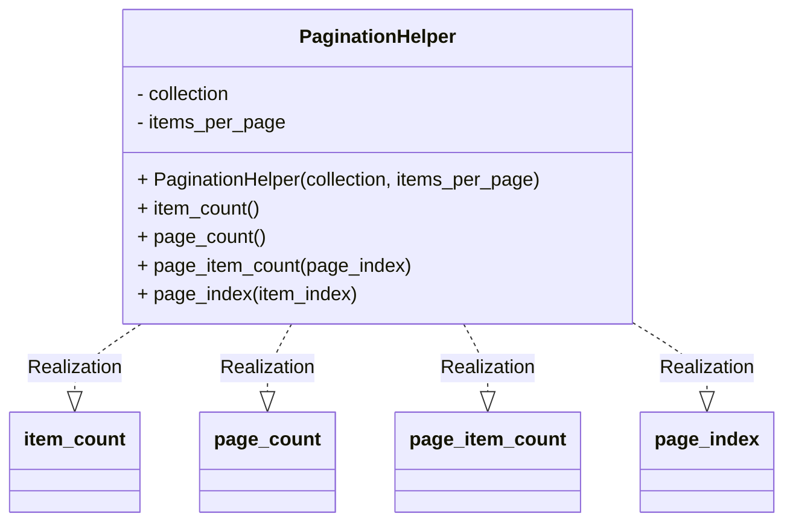

# 实验七 Python面向对象编程

班级： 21计科1

学号： 20210302103

姓名： 刘阳阳

Github地址：<https://github.com/last-xuan-official/python->

CodeWars地址：<https://www.codewars.com/users/last-xuan-official>

---

## 实验目的

1. 学习Python类和继承的基础知识
2. 学习namedtuple和DataClass的使用

## 实验环境

1. Git
2. Python 3.10
3. VSCode
4. VSCode插件

## 实验内容和步骤

### 第一部分

Python面向对象编程

完成教材《Python编程从入门到实践》下列章节的练习：

- 第9章 类

#### 9.14 彩票

```python
import random

characters='abcde0123456789'
print(''.join(random.choice(characters) for _ in range(4)))
```

- 利用random的choice函数在字符串中随机选择

---

### 第二部分

在[Codewars网站](https://www.codewars.com)注册账号，完成下列Kata挑战：

---

#### 第一题：面向对象的海盗

难度： 8kyu

啊哈，伙计!

你是一个小海盗团的首领。而且你有一个计划。在OOP的帮助下，你希望建立一个相当有效的系统来识别船上有大量战利品的船只。
对你来说，不幸的是，现在的人很重，那么你怎么知道一艘船上装的是黄金而不是人呢？

你首先要写一个通用的船舶类。

```python
class Ship:
    def __init__(self, draft, crew):
        self.draft = draft
        self.crew = crew
```

每当你的间谍看到一艘新船进入码头，他们将根据观察结果创建一个新的船舶对象。

- `draft`吃水 - 根据船在水中的高度来估计它的重量
- `crew`船员 - 船上船员的数量

`Titanic = Ship(15, 10)`

任务

你可以访问船舶的 "draft(吃水) "和 "crew(船员)"。"draft(吃水) "是船的总重量，"船员 "是船上的人数。
每个船员都会给船的吃水增加1.5个单位。如果除去船员的重量后，吃水仍然超过20，那么这艘船就值得掠夺。任何有这么重的船一定有很多战利品!
添加方法
`is_worth_it`
来决定这艘船是否值得掠夺。

例如：

```python
Titanic.is_worth_it()
False
```

祝你好运，愿你能找到金子!

代码提交地址：
<https://www.codewars.com/kata/54fe05c4762e2e3047000add>

```python
class Ship:
    def __init__(self, draft, crew):
        self.draft = draft
        self.crew = crew
    def is_worth_it(self):
        return self.draft - 1.5 * self.crew > 20
```

- 解析:在Ship类内部编写函数判断即可

---

#### 第二题： 搭建积木

难度：7kyu

写一个创建Block的类（Duh.）
构造函数应该接受一个数组作为参数，这个数组将包含3个整数，其形式为`[width, length, height]`，Block应该由这些整数创建。

定义这些方法:

- `get_width()` return the width of the `Block`
- `get_length()` return the length of the `Block`
- `get_height()` return the height of the `Block`
- `get_volume()` return the volume of the `Block`
- `get_surface_area()` return the surface area of the `Block`

例子：

```python
b = Block([2,4,6]) # create a `Block` object with a width of `2` a length of `4` and a height of `6`
b.get_width() # return 2    
b.get_length() # return 4
b.get_height() # return 6
b.get_volume() # return 48
b.get_surface_area() # return 88
```

注意： 不需要检查错误的参数。

代码提交地址：
<https://www.codewars.com/kata/55b75fcf67e558d3750000a3>

```python
class Block:
    def __init__(self,lst):
        self.width = lst[0]
        self.length = lst[1]
        self.height = lst[2]

    def get_width(self):
        return self.width
    def get_length(self):
        return self.length
    def get_height(self):
        return self.height
    def get_volume(self):
        return self.width * self.length *self.height
    def get_surface_area(self):
        return 2*(self.length * self.width + self.length * self.height + self.width * self.height)

```

---

#### 第三题： 分页助手

难度：5kyu

在这个练习中，你将加强对分页的掌握。你将完成PaginationHelper类，这是一个实用类，有助于查询与数组有关的分页信息。
该类被设计成接收一个值的数组和一个整数，表示每页允许多少个项目。集合/数组中包含的值的类型并不相关。

下面是一些关于如何使用这个类的例子：

```python
helper = PaginationHelper(['a','b','c','d','e','f'], 4)
helper.page_count() # should == 2
helper.item_count() # should == 6
helper.page_item_count(0)  # should == 4
helper.page_item_count(1) # last page - should == 2
helper.page_item_count(2) # should == -1 since the page is invalid

# page_index takes an item index and returns the page that it belongs on
helper.page_index(5) # should == 1 (zero based index)
helper.page_index(2) # should == 0
helper.page_index(20) # should == -1
helper.page_index(-10) # should == -1 because negative indexes are invalid
```

代码提交地址：
<https://www.codewars.com/kata/515bb423de843ea99400000a>

```python
class PaginationHelper:
    def __init__(self, collection, items_per_page):
        self.collection = collection
        self.items_per_page = items_per_page
    def item_count(self):
        return len(self.collection)
    def page_count(self):
        return len(self.collection) // self.items_per_page + (len(self.collection) % self.items_per_page != 0)
    def page_item_count(self, page_index):
        if page_index > self.page_count() - 1 or page_index < 0:
            return -1
        return self.item_count() % self.items_per_page if self.page_count() - 1 == page_index and (
                    self.item_count() % self.items_per_page != 0) else self.items_per_page
    def page_index(self, item_index):
        if self.item_count() - 1 < item_index or item_index < 0:
            return -1
        return item_index // self.items_per_page
```

---

#### 第四题： 向量（Vector）类

难度： 5kyu

创建一个支持加法、减法、点积和向量长度的向量（Vector）类。

举例来说：

```python
a = Vector([1, 2, 3])
b = Vector([3, 4, 5])
c = Vector([5, 6, 7, 8])

a.add(b)      # should return a new Vector([4, 6, 8])
a.subtract(b) # should return a new Vector([-2, -2, -2])
a.dot(b)      # should return 1*3 + 2*4 + 3*5 = 26
a.norm()      # should return sqrt(1^2 + 2^2 + 3^2) = sqrt(14)
a.add(c)      # raises an exception
```

如果你试图对两个不同长度的向量进行加减或点缀，你必须抛出一个错误。
向量类还应该提供：

- 一个 `__str__` 方法，这样 `str(a) === '(1,2,3)'` 
- 一个equals方法，用来检查两个具有相同成分的向量是否相等。

注意：测试案例将利用用户提供的equals方法。

代码提交地址：
<https://www.codewars.com/kata/526dad7f8c0eb5c4640000a4>

```python
from math import sqrt


class Vector:
    def __init__(self,lst):
        self.lst = lst

    def __str__(self):
        stp=str(tuple(self.lst)).replace(' ','')
        return stp

    def add(self,vector):
        if len(self.lst) != len(vector.lst):
            raise IndexError("向量维度不一")

        return Vector([self.lst[i] + vector.lst[i] for i in range(len(vector.lst))])

    def subtract(self,vector):
        if len(self.lst) != len(vector.lst):
            raise IndexError("向量维度不一")

        return Vector([self.lst[i] - vector.lst[i] for i in range(len(vector.lst))])

    def dot(self,vector):
        if len(self.lst) != len(vector.lst):
            raise IndexError("向量维度不一")

        return sum([self.lst[i] * vector.lst[i] for i in range(len(vector.lst))])

    def norm(self):
        return sqrt(sum([self.lst[i] ** 2 for i in range(len(self.lst))]))

    def equals(self,vector):
        v1=self.lst
        v2=vector.lst
        if len(v1) != len(v2):
            return False

        if all(x == 0 for x in v1) or all(x == 0 for x in v2):
            return True

        ratios = [v1[i] / v2[i] if v2[i] != 0 else float('inf') for i in range(len(v1))]

        return all(ratio == ratios[0] for ratio in ratios)

```

- 解析：注意函数返回类型和相同向量的判断即可

---

#### 第五题： Codewars风格的等级系统

难度： 4kyu

编写一个名为User的类，用于计算用户在类似于Codewars使用的排名系统中的进步量。

业务规则：

- 一个用户从等级-8开始，可以一直进步到8。
- 没有0（零）等级。在-1之后的下一个等级是1。
- 用户将完成活动。这些活动也有等级。
- 每当用户完成一个有等级的活动，用户的等级进度就会根据活动的等级进行更新。
- 完成活动获得的进度是相对于用户当前的等级与活动的等级而言的。
- 用户的等级进度从零开始，每当进度达到100时，用户的等级就会升级到下一个等级。
- 在上一等级时获得的任何剩余进度都将被应用于下一等级的进度（我们不会丢弃任何进度）。例外的情况是，如果没有其他等级的进展（一旦你达到8级，就没有更多的进展了）。
- 一个用户不能超过8级。
- 唯一可接受的等级值范围是-8,-7,-6,-5,-4,-3,-2,-1,1,2,3,4,5,6,7,8。任何其他的值都应该引起错误。

逻辑案例：

- 如果一个排名为-8的用户完成了一个排名为-7的活动，他们将获得10的进度。
- 如果一个排名为-8的用户完成了排名为-6的活动，他们将获得40的进展。
- 如果一个排名为-8的用户完成了排名为-5的活动，他们将获得90的进展。
- 如果一个排名-8的用户完成了排名-4的活动，他们将获得160个进度，从而使该用户升级到排名-7，并获得60个进度以获得下一个排名。
- 如果一个等级为-1的用户完成了一个等级为1的活动，他们将获得10个进度（记住，零等级会被忽略）。

代码案例：

```python
user = User()
user.rank # => -8
user.progress # => 0
user.inc_progress(-7)
user.progress # => 10
user.inc_progress(-5) # will add 90 progress
user.progress # => 0 # progress is now zero
user.rank # => -7 # rank was upgraded to -7
```

代码提交地址：
<https://www.codewars.com/kata/51fda2d95d6efda45e00004e>

```python
Rank = [i for i in range(-8, 9) if i != 0]

class User:
    def __init__(self, rank = -8, progress = 0):
        self.rank = rank
        self.progress = progress

    def inc_progress(self, stage):
        if Rank.index(stage) == Rank.index(self.rank) - 1:
            self.progress += 1
        elif Rank.index(stage) == Rank.index(self.rank):
            self.progress += 3
        elif Rank.index(stage) - Rank.index(self.rank) >= 1:
            self.progress += (Rank.index(stage) - Rank.index(self.rank)) ** 2 * 10
    
        if self.progress >= 100:
            self.rank = min(8, self.rank + self.progress // 100 + (self.rank < 0 and self.rank + self.progress // 100 >= 0))
            
        self.rank = self.rank + 1 if self.rank == 0 else self.rank 
        self.progress = self.progress % 100 if self.rank != 8 else 0
        return [self.rank,self.progress]
```

- 注意题目细节即可

---

### 第三部分

使用Mermaid绘制程序的**类图**



## 实验考查

请使用自己的语言并使用尽量简短代码示例回答下面的问题，这些问题将在实验检查时用于提问和答辩以及实际的操作。

1. Python的类中__init__方法起什么作用？

__init__ 方法是Python类中的构造函数，用于初始化对象的属性。它在创建类的实例时自动调用。

```python
class MyClass:
    def __init__(self, value):
        self.value = value
obj = MyClass(10)  # 调用__init__方法来初始化对象属性
```

2. Python语言中如何继承父类和改写（override）父类的方法。

要继承父类并改写父类的方法，可以在子类中定义一个同名的方法，即方法重写（override）。

```python
Copy code
class ParentClass:
    def some_method(self):
        print("Parent method")

class ChildClass(ParentClass):
    def some_method(self):  # 改写父类的方法
        print("Child method")

child_obj = ChildClass()
child_obj.some_method()  # 调用子类方法
```

3. Python类有那些特殊的方法？它们的作用是什么？请举三个例子并编写简单的代码说明。


a. __ str __: 返回对象的可读性字符串表示。

```python
class MyClass:
    def __init__(self, value):
        self.value = value
    
    def __str__(self):
        return f"MyClass instance with value {self.value}"

obj = MyClass(42)
print(obj)  # 输出自定义的字符串表示
```

b. __ len __: 返回对象的长度。

```python

class MyList:
    def __init__(self, items):
        self.items = items
    
    def __len__(self):
        return len(self.items)

my_list = MyList([1, 2, 3, 4])
print(len(my_list)  # 输出列表长度
```

c. __ add __: 自定义对象的加法操作。

```python
class Point:
    def __init__(self, x, y):
        self.x = x
        self.y = y
    
    def __add__(self, other):
        new_x = self.x + other.x
        new_y = self.y + other.y
        return Point(new_x, new_y)

p1 = Point(1, 2)
p2 = Point(3, 4)
result = p1 + p2  # 自定义的加法操作
## 实验总结
```

总结一下这次实验你学习和使用到的知识，例如：编程工具的使用、数据结构、程序语言的语法、算法、编程技巧、编程思想。
            __init__ 方法是Python类中的构造函数，用于初始化对象的属性。它在创建类的实例时自动调用，是类的初始化方法。

            在Python中，要继承父类并改写（override）父类的方法，可以在子类中定义一个同名的方法。这允许子类重定义父类的行为，实现方法的多态性。

            Python类有许多特殊的方法，也称为魔法方法，用于定制类的行为。我提供了三个例子：__str__ 用于返回对象的可读性字符串表示，__len__ 用于返回对象的长度，__add__ 用于自定义对象的加法操作。

            这次实验学习和使用了Python的面向对象编程概念，了解了类、对象、构造函数、继承、方法重写以及特殊方法的用途。通过编写简单的代码示例，加深了对这些概念的理解。此外，实验强调了代码示例的重要性，以清晰和简洁的方式传达编程知识。这些知识对于编写更复杂的程序和定制类的行为非常有帮助。
