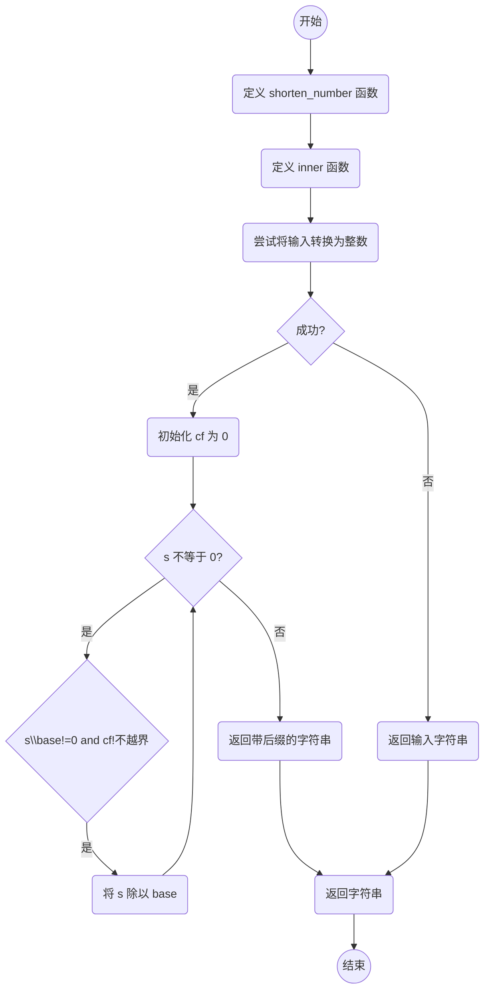

# 实验六 Python函数

班级： 21计科1

学号： 20210302103

姓名： 刘阳阳

Github地址：<https://github.com/last-xuan-official/python->

CodeWars地址：<https://www.codewars.com/users/last-xuan-official>

---

## 实验目的

1. 学习Python函数的基本用法
2. 学习lambda函数和高阶函数的使用
3. 掌握函数式编程的概念和实践

## 实验环境

1. Git
2. Python 3.10
3. VSCode
4. VSCode插件

## 实验内容和步骤

### 第一部分

Python函数

完成教材《Python编程从入门到实践》下列章节的练习：

- 第8章 函数

#### 8.9 消息

```python
message_lst=["hello","你好"]

def show_message(lst):
    for message in lst:
        print(message)
```

---

### 第二部分

在[Codewars网站](https://www.codewars.com)注册账号，完成下列Kata挑战：

---

#### 第一题：编码聚会1

难度： 7kyu

你将得到一个字典数组，代表关于首次报名参加你所组织的编码聚会的开发者的数据。
你的任务是返回来自欧洲的JavaScript开发者的数量。
例如，给定以下列表：

```python
lst1 = [
  { 'firstName': 'Noah', 'lastName': 'M.', 'country': 'Switzerland', 'continent': 'Europe', 'age': 19, 'language': 'JavaScript' },
  { 'firstName': 'Maia', 'lastName': 'S.', 'country': 'Tahiti', 'continent': 'Oceania', 'age': 28, 'language': 'JavaScript' },
  { 'firstName': 'Shufen', 'lastName': 'L.', 'country': 'Taiwan', 'continent': 'Asia', 'age': 35, 'language': 'HTML' },
  { 'firstName': 'Sumayah', 'lastName': 'M.', 'country': 'Tajikistan', 'continent': 'Asia', 'age': 30, 'language': 'CSS' }
]
```

你的函数应该返回数字1。
如果，没有来自欧洲的JavaScript开发人员，那么你的函数应该返回0。

注意：
字符串的格式将总是"Europe"和"JavaScript"。
所有的数据将始终是有效的和统一的，如上面的例子。

这个卡塔是Coding Meetup系列的一部分，其中包括一些简短易行的卡塔，这些卡塔是为了让人们掌握高阶函数的使用。在Python中，这些方法包括：`filter`, `map`, `reduce`。当然也可以采用其他方法来解决这些卡塔。

[代码提交地址](https://www.codewars.com/kata/coding-meetup-number-1-higher-order-functions-series-count-the-number-of-javascript-developers-coming-from-europe)

---

```python
def count_developers(lst):
    cnt = 0 
    for d in lst:
        if d['continent'] == 'Europe' and d['language'] == 'JavaScript' :
            cnt+=1
    return cnt
    
```

-解析：利用字典特性

#### 第二题： 使用函数进行计算

难度：5kyu

这次我们想用函数来写计算，并得到结果。让我们看一下一些例子：

```python
seven(times(five())) # must return 35
four(plus(nine())) # must return 13
eight(minus(three())) # must return 5
six(divided_by(two())) # must return 3
```

要求：

- 从0（"零"）到9（"九"）的每个数字都必须有一个函数。
- 必须有一个函数用于以下数学运算：加、减、乘、除。
- 每个计算都由一个操作和两个数字组成。
- 最外面的函数代表左边的操作数，最里面的函数代表右边的操作数。
- 除法应该是整数除法。

例如，下面的计算应该返回2，而不是2.666666...。

```python
def zero(str=''):
    if str == '':
        return '0'
    return eval('0'+str)#your code here
def one(str=''):
    if str == '':
        return '1'
    return eval('1'+str)#your code here
def two(str=''):
    if str == '':
        return '2'
    return eval('2'+str)#your code here
def three(str=''):
    if str == '':
        return '3'
    return eval('3'+str)#your code here
def four(str=''):
    if str == '':
        return '4'
    return eval('4'+str)#your code here
def five(str=''):
    if str == '':
        return '5'
    return eval('5'+str)#your code here
def six(str=''):
    if str == '':
        return '6'
    return eval('6'+str)#your code here
def seven(str=''):
    if str == '':
        return '7'
    return eval('7'+str)#your code here
def eight(str=''):
    if str == '':
        return '8'
    return eval('8'+str)#your code here
def nine(str=''):
    if str == '':
        return '9'
    return eval('9'+str)#your code here

def plus(str=''):
    return '+'+str#your code here
def minus(str=''):
    return '-'+str#your code here
def times(str=''):
    return '*'+str#your code here
def divided_by(str=''):
    return '//'+str#your code here
```

代码提交地址：
<https://www.codewars.com/kata/525f3eda17c7cd9f9e000b39>

-解析：使用eval函数进行字符串模拟运算

---

#### 第三题： 缩短数值的过滤器(Number Shortening Filter)

难度：6kyu

在这个kata中，我们将创建一个函数，它返回另一个缩短长数字的函数。给定一个初始值数组替换给定基数的 X 次方。如果返回函数的输入不是数字字符串，则应将输入本身作为字符串返回。

例子：

```python
filter1 = shorten_number(['','k','m'],1000)
filter1('234324') == '234k'
filter1('98234324') == '98m'
filter1([1,2,3]) == '[1,2,3]'
filter2 = shorten_number(['B','KB','MB','GB'],1024)
filter2('32') == '32B'
filter2('2100') == '2KB';
filter2('pippi') == 'pippi'
```

代码提交地址：
<https://www.codewars.com/kata/56b4af8ac6167012ec00006f>

```python
def shorten_number(suffixes=[], base = 10):
    def inner(s):
        try:
            s = int(s)
            cf = 0
            while s != 0:
                if s // base != 0 and cf != len(suffixes)-1:
                    s //= base
                    cf += 1
                else:
                    return str(s) + suffixes[min(cf, len(suffixes) - 1)]
        except:
            return str(s)
    
    return inner
```

- 通过封装inner函数从而使测试的filter对函数传参 

---

#### 第四题： 编码聚会7

难度： 6kyu

您将获得一个对象序列，表示已注册参加您组织的下一个编程聚会的开发人员的数据。

您的任务是返回一个序列，其中包括最年长的开发人员。如果有多个开发人员年龄相同，则将他们按照在原始输入数组中出现的顺序列出。

例如，给定以下输入数组：
```python
list1 = [
  { 'firstName': 'Gabriel', 'lastName': 'X.', 'country': 'Monaco', 'continent': 'Europe', 'age': 49, 'language': 'PHP' },
  { 'firstName': 'Odval', 'lastName': 'F.', 'country': 'Mongolia', 'continent': 'Asia', 'age': 38, 'language': 'Python' },
  { 'firstName': 'Emilija', 'lastName': 'S.', 'country': 'Lithuania', 'continent': 'Europe', 'age': 19, 'language': 'Python' },
  { 'firstName': 'Sou', 'lastName': 'B.', 'country': 'Japan', 'continent': 'Asia', 'age': 49, 'language': 'PHP' },
]
```

您的程序应该返回如下结果：

```python
[
  { 'firstName': 'Gabriel', 'lastName': 'X.', 'country': 'Monaco', 'continent': 'Europe', 'age': 49, 'language': 'PHP' },
  { 'firstName': 'Sou', 'lastName': 'B.', 'country': 'Japan', 'continent': 'Asia', 'age': 49, 'language': 'PHP' },
]
```

注意：

- 输入的列表永远都包含像示例中一样有效的正确格式的数据，而且永远不会为空。

代码提交地址：
<https://www.codewars.com/kata/582887f7d04efdaae3000090>

```python
def find_senior(lst):
    sorted_by_age_desc = sorted(lst, key = lambda x: x["age"],reverse = True)
    return [old for old in sorted_by_age_desc if old['age'] == sorted_by_age_desc[0]['age']]
```

- 解析：排序后依次输入最年长的人

---

#### 第五题： Currying versus partial application

难度： 4kyu

[Currying versus partial application](https://2ality.com/2011/09/currying-vs-part-eval.html)是将一个函数转换为具有更小arity(参数更少)的另一个函数的两种方法。虽然它们经常被混淆，但它们的工作方式是不同的。目标是学会区分它们。

Currying

是一种将接受多个参数的函数转换为以每个参数都只接受一个参数的一系列函数链的技术。

Currying接受一个函数：

```python
f：X × Y → R
```

并将其转换为一个函数：

```python
f'：X → (Y → R)
```

我们不再使用两个参数调用f，而是使用第一个参数调用f'。结果是一个函数，然后我们使用第二个参数调用该函数来产生结果。因此，如果非curried f被调用为：

```python
f(3, 5)
```

那么curried f'被调用为：

```python
f'(3)(5)
```

示例
给定以下函数：

```python
def add(x, y, z):
  return x + y + z
```

我们可以以普通方式调用：

```python
add(1, 2, 3) # => 6
```

但我们可以创建一个curried版本的add(a, b, c)函数：

```python
curriedAdd = lambda a: (lambda b: (lambda c: add(a,b,c)))
curriedAdd(1)(2)(3) # => 6
```

Partial application
是将一定数量的参数固定到函数中，从而产生另一个更小arity(参数更少)的函数的过程。

部分应用接受一个函数：

```python
f：X × Y → R
```

和一个固定值x作为第一个参数，以产生一个新的函数

```python
f'：Y → R
```

f'与f执行的操作相同，但只需要填写第二个参数，这就是其arity比f的arity少一个的原因。可以说第一个参数绑定到x。

示例:

```python
partialAdd = lambda a: (lambda *args: add(a,*args))
partialAdd(1)(2, 3) # => 6
```

你的任务是实现一个名为curryPartial()的通用函数，可以进行currying或部分应用。

例如：

```python
curriedAdd = curryPartial(add)
curriedAdd(1)(2)(3) # => 6

partialAdd = curryPartial(add, 1)
partialAdd(2, 3) # => 6
```

我们希望函数保持灵活性。

所有下面这些例子都应该产生相同的结果：

```python
curryPartial(add)(1)(2)(3) # =>6 
curryPartial(add, 1)(2)(3) # =>6 
curryPartial(add, 1)(2, 3) # =>6 
curryPartial(add, 1, 2)(3) # =>6 
curryPartial(add, 1, 2, 3) # =>6 
curryPartial(add)(1, 2, 3) # =>6 
curryPartial(add)(1, 2)(3) # =>6 
curryPartial(add)()(1, 2, 3) # =>6 
curryPartial(add)()(1)()()(2)(3) # =>6 

curryPartial(add)()(1)()()(2)(3, 4, 5, 6) # =>6 
curryPartial(add, 1)(2, 3, 4, 5) # =>6 

curryPartial(curryPartial(curryPartial(add, 1), 2), 3) # =>6
curryPartial(curryPartial(add, 1, 2), 3) # =>6
curryPartial(curryPartial(add, 1), 2, 3) # =>6
curryPartial(curryPartial(add, 1), 2)(3) # =>6
curryPartial(curryPartial(add, 1)(2), 3) # =>6
curryPartial(curryPartial(curryPartial(add, 1)), 2, 3) # =>6
```

代码提交地址：
<https://www.codewars.com/kata/53cf7e37e9876c35a60002c9>

```python
def curry_partial(f,*args):
    if not callable(f):
        return f
    if len(args) < f.__code__.co_argcount:
        return lambda *a: curry_partial(f, *(args + a))
    return f(*args[:f.__code__.co_argcount or None])
```

- 解析：
   
        args + a：这将合并已经传递的参数 args 和新参数 a，以创建一个更长的参数列表。

        curry_partial(f, *(args + a))：这将调用 curry_partial 函数，传递目标函数 f 和新的参数列表，这个新参数列表包含了已经传递的参数和新传递的参数（一个一个加）。

        这意味着如果条件 len(args) < f.__code__.co_argcount 成立，函数将返回一个新的函数，这个新函数可以接受更多参数，以供后续使用。这样可以实现柯里化，允许你逐步传递参数，直到满足目标函数的参数需求。

---

### 第三部分



## 实验过程与结果

请将实验过程与结果放在这里，包括：

- [第一部分 Python函数](#第一部分)
- [第二部分 Codewars Kata挑战](#第二部分)
- [第三部分 使用Mermaid绘制程序流程图](#第三部分)

代码运行结果的文本可以直接粘贴在这里。

**注意：不要使用截图，Markdown文档转换为Pdf格式后，截图可能会无法显示。**

## 实验考查

请使用自己的语言并使用尽量简短代码示例回答下面的问题，这些问题将在实验检查时用于提问和答辩以及实际的操作。

1. 什么是函数式编程范式？

        函数式编程范式是一种编程方式，它将计算视为数学函数的组合，避免了共享状态和可变数据。它强调不可变性和纯函数，其中相同的输入始终产生相同的输出。函数式编程范式具有高度的可组合性和抽象性。

2. 什么是lambda函数？请举例说明。

        Lambda函数是匿名函数，通常用于定义简单的、一次性的函数。它使用lambda关键字，通常在需要函数的地方定义，不需要显式命名。示例：

```python
square = lambda x: x ** 2
result = square(5)  # result=25
```

3. 什么是高阶函数？常用的高阶函数有哪些？这些高阶函数如何工作？使用简单的代码示例说明。

              高阶函数是能够接受其他函数作为参数或返回函数作为结果的函数。常用的高阶函数包括map()、filter()、reduce()等。它们工作方式如下：

map(function, iterable): 将函数应用于可迭代对象的每个元素，返回结果列表。
```python
numbers = [1, 2, 3, 4, 5]
squared = list(map(lambda x: x ** 2, numbers))  # [1, 4, 9, 16, 25]
filter(function, iterable): 使用函数筛选可迭代对象中的元素，返回结果列表。
```

filter()为筛选器

```python
numbers = [1, 2, 3, 4, 5]
even = list(filter(lambda x: x % 2 == 0, numbers))  # [2, 4]
```

reduce(function, iterable): 使用给定的函数依次对可迭代对象中的元素进行累积操作。

```python
from functools import reduce
numbers = [1, 2, 3, 4, 5]
sum_of_numbers = reduce(lambda x, y: x + y, numbers)  # 15
```

## 实验总结

总结一下这次实验你学习和使用到的知识，例如：编程工具的使用、数据结构、程序语言的语法、算法、编程技巧、编程思想。

        在这次实验中，我学习和使用了以下知识和技能：

        函数式编程范式： 我了解了函数式编程是一种编程方式，它强调不可变性、纯函数和数学函数的组合，避免了共享状态和可变数据，具有高度的可组合性和抽象性。

        Lambda函数： 我学习了Lambda函数是匿名函数，通常用于定义简单的、一次性的函数，它在需要函数的地方定义，不需要显式命名，提供了一种紧凑的函数定义方式。

        高阶函数： 我了解了高阶函数是能够接受其他函数作为参数或返回函数作为结果的函数。我掌握了map()、filter()和reduce()等常用高阶函数的用法，它们用于对可迭代对象进行操作，包括映射、筛选和累积。

        这次实验帮助我更深入地理解函数式编程概念，掌握了Lambda函数的用法以及高阶函数的工作原理。我还加强了编程技巧和编程思维，这对于在解决问题和编写高效的代码时非常有帮助。总的来说，这次实验对我的编程知识和技能有所提升，有助于更好地理解不同的编程范式和工具。
