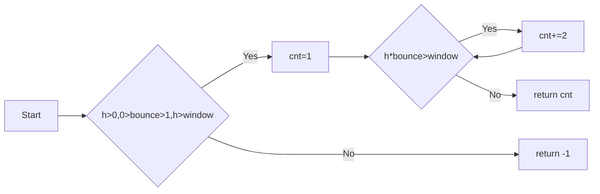

# Python实验报告2： Python变量、简单数据类型
班级： 21计科1班

学号： 20210302103

姓名： 刘阳阳

Github地址：<https://github.com/last-xuan-official/python->

CodeWars地址：<https://www.codewars.com/users/last-xuan-official>

## 第一部分 Python变量、简单数据类型和列表简介

* 练习2.3

代码
```python
  name='lyy'
  print(f"Hello {name},would you like to learn Python today?")
```

输出
```
Hello lyy,would you like to learn Python today?
```
* 练习2.4

代码
 ```python
name='lyy'
print(name.title())
print(name.upper())
print(name.lower())
 ```

 输出
```
lyy
lyy
lyy
```
* 练习2.5

代码
```python
str="孔子说：“学而不思则罔”"
print(str)
```

输出
```
孔子说：“学而不思则罔”
```
* 练习2.6

代码
```python
name="孔子说："
message="学而不思则罔"
print(name+message)
```

输出
```
孔子说：学而不思则罔
```
* 练习2.7

代码
```python
name= ' \t lyy \n '
print(name)
name.rstrip()
name.lstrip()
name.strip()
print(name)
```

输出
```
 	 lyy 
 
 	 lyy
```
* 练习2.8

代码
```python
filename='python_notes.txt'
print(filename.removesuffix('.txt'))
```

输出
```
python_notes
```

## 第二部分 Codewars Kata挑战
### 第1题：求离整数n最近的平方数（Find Nearest square number）

难度：8kyu

你的任务是找到一个正整数n的最近的平方数 例如，如果n=111，那么nearest_sq(n)（nearestSq(n)）等于121，因为111比100（10的平方）更接近121（11的平方）。 如果n已经是完全平方（例如n=144，n=81，等等），你需要直接返回n。 

[代码提交地址](https://www.codewars.com/kata/5a805d8cafa10f8b930005ba) 
```python
from math import ceil, sqrt


def nearest_sq(n):
    shang = ceil(sqrt(n)) ** 2
    xia = int(sqrt(n)) ** 2
    return shang if abs(shang - n) < abs(xia - n) else xia
```

* 解析：
引入math库的向上取整函数ceil和开平方sqrt

### 第2题：弹跳的球（Bouncing Balls）

难度：6kyu

一个孩子在一栋高楼的第N层玩球。这层楼离地面的高度h是已知的。他把球从窗口扔出去。球弹了起来, 例如:弹到其高度的三分之二（弹力为0.66）。他的母亲从离地面w米的窗户向外看,母亲会看到球在她的窗前经过多少次（包括球下落和反弹的时候）？

一个有效的实验必须满足三个条件：

1. 参数 "h"（米）必须大于0
2. 参数 "bounce "必须大于0且小于1
3. 参数 “window "必须小于h。

如果以上三个条件都满足，返回一个正整数，否则返回-1。 注意:只有当反弹球的高度严格大于窗口参数时，才能看到球。 

[代码提交地址](https://www.codewars.com/kata/5544c7a5cb454edb3c000047/train/python)
```python
def bouncing_ball(h, bounce, window):
    if h>0.0 and 0.0<bounce<1.0 and h>window:
        cnt=1
        while h*bounce>window:
            h*=bounce
            cnt+=2
        return cnt
    return -1
```
* 解析：
小球下落上升有两次经过窗户，首次下落算一次经过窗户，循环判断即可

### 第3题： 元音统计(Vowel Count)

难度： 7kyu

返回给定字符串中元音的数量（计数）。对于这个Kata，我们将考虑a、e、i、o、u作为元音（但不包括y）。输入的字符串将只由小写字母和/或空格组成。

[代码提交地址](https://www.codewars.com/kata/54ff3102c1bad923760001f3)
```python
def get_count(sentence):
    yy="aoeiu"
    cnt=0
    for c in yy:
        cnt+=sentence.count(c)
    return cnt
```
* 解析：将元音存到一个字符串中，再利用string的count库计算各元音出现的次数累加

### 第4题：偶数或者奇数（Even or Odd）
难度：8kyu

创建一个函数接收一个整数作为参数，当整数为偶数时返回”Even”当整数位奇数时返回”Odd”。 

[代码提交地址](https://www.codewars.com/kata/53da3dbb4a5168369a0000fe) 
```python
def even_or_odd(number):
    return "Odd" if number%2 else "Even"
```
* 解析：利用数取余的特性
## 第三部分 使用Mermaid绘制程序流程图

第2题：弹跳的球（Bouncing Balls）流程图如下：




## 第四部分 实验考查

请使用自己的语言并使用尽量简短代码示例回答下面的问题，这些问题将在实验检查时用于提问和答辩以及实际的操作。

1. Python中的简单数据类型有那些？我们可以对这些数据类型做哪些操作？
 
           Python中的简单数据类型包括整数（int）、浮点数（float）、字符串（str）、布尔值（bool）和空值（None）。我们可以对这些数据类型进行各种操作，例如数学运算、字符串拼接、比较操作等。

1. 为什么说Python中的变量都是标签？

         Python中的变量都是标签，这意味着变量实际上是对内存中对象的引用。当我们将一个变量赋值给另一个变量时，它们实际上指向相同的对象，而不是创建了一个新的对象。这可以节省内存并使对象的管理更高效。


1. 有哪些方法可以提高Python代码的可读性？


        有多种方法可以提高Python代码的可读性，包括：
          使用有意义的变量名：给变量和函数起清晰、描述性的名称，以便他人能够理解代码的含义。
          编写注释：在关键部分添加注释，解释代码的作用和思路。
          使用空格和缩进：保持一致的缩进风格，以增强代码的结构可读性。
          拆分长行：将长的代码行拆分成多行，以避免水平滚动，并提高可读性。
          使用函数和模块：将代码分解成函数和模块，以便模块化和复用。
          遵循PEP 8规范：PEP 8是Python的风格指南，遵循它可以提高代码的一致性和可读性。


## 第五部分 实验总结
总结一下这次实验你学习和使用到的知识，例如：编程工具的使用、数据结构、程序语言的语法、算法、编程技巧、编程思想。

       在这次实验中，我学习了Python中的简单数据类型和它们的操作，了解了Python中变量都是标签的概念，以及提高Python代码可读性的一些方法。我还强调了良好的编程实践，如有意义的命名、注释、缩进和模块化，这些都是编写清晰、易于理解和维护的Python代码的关键。我还了解到了PEP 8规范，它是Python社区的通用编程风格指南，有助于编写规范的Python代码。这些知识和技巧将帮助我在编程中更有效地使用Python语言。
