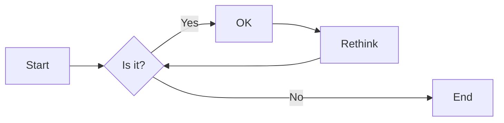
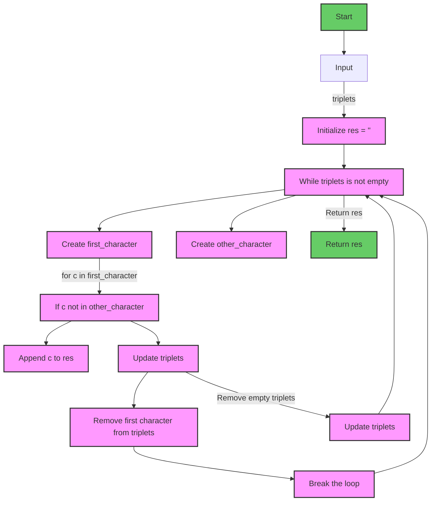

# 实验三 Python列表

班级： 21计科1

学号： 20210302103

姓名： 刘阳阳

Github地址：<https://github.com/last-xuan-official/python->

CodeWars地址：<https://www.codewars.com/users/last-xuan-official>

---

## 实验目的

1. 学习Python的简单使用和列表操作
2. 学习Python中的if语句

## 实验环境

1. Git
2. Python 3.10
3. VSCode
4. VSCode插件

## 实验内容和步骤

### 第一部分

Python列表操作

完成教材《Python编程从入门到实践》下列章节的练习：

- 第3章 列表简介
- 第4章 操作列表
- 第5章 if语句

---

### 第二部分

在[Codewars网站](https://www.codewars.com)注册账号，完成下列Kata挑战：

---

#### 第一题：3和5的倍数（Multiples of 3 or 5）

难度： 6kyu

如果我们列出所有低于 10 的 3 或 5 倍数的自然数，我们得到 3、5、6 和 9。这些数的总和为 23. 完成一个函数，使其返回小于某个整数的所有是3 或 5 的倍数的数的总和。此外，如果数字为负数，则返回 0。

注意：如果一个数同时是3和5的倍数，应该只被算一次。

**提示：首先使用列表解析得到一个列表，元素全部是3或者5的倍数。
使用sum函数可以获取这个列表所有元素的和.**

代码提交地址：
<https://www.codewars.com/kata/514b92a657cdc65150000006>

---

#### 第二题： 重复字符的编码器（Duplicate Encoder）

难度： 6kyu

本练习的目的是将一个字符串转换为一个新的字符串，如果新字符串中的每个字符在原字符串中只出现一次，则为"("，如果该字符在原字符串中出现多次，则为")"。在判断一个字符是否是重复的时候，请忽略大写字母。

例如:

```python
"din"      =>  "((("
"recede"   =>  "()()()"
"Success"  =>  ")())())"
"(( @"     =>  "))(("
```

代码提交地址:
<https://www.codewars.com/kata/54b42f9314d9229fd6000d9c>

---

#### 第三题：括号匹配（Valid Braces）

难度：6kyu

写一个函数，接收一串括号，并确定括号的顺序是否有效。如果字符串是有效的，它应该返回True，如果是无效的，它应该返回False。
例如：

```python
"(){}[]" => True 
"([{}])" => True
 "(}" => False
 "[(])" => False 
"[({})](]" => False
```

**提示：
python中没有内置堆栈数据结构，可以直接使用`list`来作为堆栈，其中`append`方法用于入栈，`pop`方法可以出栈。**

代码提交地址
<https://www.codewars.com/kata/5277c8a221e209d3f6000b56>

---

#### 第四题： 从随机三元组中恢复秘密字符串(Recover a secret string from random triplets)

难度： 4kyu

有一个不为你所知的秘密字符串。给出一个随机三个字母的组合的集合，恢复原来的字符串。

这里的三个字母的组合被定义为三个字母的序列，每个字母在给定的字符串中出现在下一个字母之前。"whi "是字符串 "whatisup "的一个三个字母的组合。

作为一种简化，你可以假设没有一个字母在秘密字符串中出现超过一次。

对于给你的三个字母的组合，除了它们是有效的三个字母的组合以及它们包含足够的信息来推导出原始字符串之外，你可以不做任何假设。特别是，这意味着秘密字符串永远不会包含不出现在给你的三个字母的组合中的字母。

测试用例：

```python
secret = "whatisup"
triplets = [
  ['t','u','p'],
  ['w','h','i'],
  ['t','s','u'],
  ['a','t','s'],
  ['h','a','p'],
  ['t','i','s'],
  ['w','h','s']
]
test.assert_equals(recoverSecret(triplets), secret)
```

代码提交地址：
<https://www.codewars.com/kata/53f40dff5f9d31b813000774/train/python>

提示：

- 利用集合去掉`triplets`中的重复字母，得到字母集合`letters`，最后的`secret`应该由集合中的字母组成，`secret`长度也等于该集合。

```python
letters = {letter for triplet in triplets for letter in triplet }
length = len(letters)
```

- 创建函数`check_first_letter(triplets, first_letter)`，检测一个字母是不是secret的首字母，返回True或者False。
- 创建函数`remove_first_letter(triplets, first_letter)`,  从三元组中去掉首字母，返回新的三元组。
- 遍历字母集合letters，利用上面2个函数得到最后的结果`secret`。

---

#### 第五题： 去掉喷子的元音（Disemvowel Trolls）

难度： 7kyu

喷子正在攻击你的评论区!
处理这种情况的一个常见方法是删除喷子评论中的所有元音(字母：a,e,i,o,u)，以消除威胁。
你的任务是写一个函数，接收一个字符串并返回一个去除所有元音的新字符串。
例如，字符串 "This website is for losers LOL!"   将变成 "Ths wbst s fr lsrs LL!".

注意：对于这个Kata来说，y不被认为是元音。
代码提交地址：
<https://www.codewars.com/kata/52fba66badcd10859f00097e>

提示：

- 首先使用列表解析得到一个列表，列表中所有不是元音的字母。
- 使用字符串的join方法连结列表中所有的字母，例如：

```python
last_name = "lovelace"
letters = [letter for letter in last_name ]
print(letters) # ['l', 'o', 'v', 'e', 'l', 'a', 'c', 'e']
name = ''.join(letters) # name = "lovelace"
```

---

### 第三部分

使用Mermaid绘制程序流程图

安装VSCode插件：

- Markdown Preview Mermaid Support
- Mermaid Markdown Syntax Highlighting

使用Markdown语法绘制你的程序绘制程序流程图（至少一个），Markdown代码如下：


显示效果如下：



查看Mermaid流程图语法-->[点击这里](https://mermaid.js.org/syntax/flowchart.html)

使用Markdown编辑器（例如VScode）编写本次实验的实验报告，包括[实验过程与结果](#实验过程与结果)、[实验考查](#实验考查)和[实验总结](#实验总结)，并将其导出为 **PDF格式** 来提交。

## 实验过程与结果

请将实验过程与结果放在这里，包括：

- [第一部分 Python列表操作和if语句](#第一部分)
- [第二部分 Codewars Kata挑战](#第二部分)
- [第三部分 使用Mermaid绘制程序流程图](#第三部分)

#### 3.5 修改嘉宾名单

```python
guest_list=['aaa', 'bbb', 'ccc']
guest_list.remove('aaa')
guest_list.append('ddd')
print(guest_list)
```

输出：

```txt
['bbb','ccc','ddd']
```

#### 3.9 修改嘉宾名单

```python
guest_list=['aaa', 'bbb', 'ccc']
guest_list.remove('aaa')
guest_list.append('ddd')
print(f"我邀请了{len(guest_list)},分别是："guest_list)
```

输出：

```txt
['bbb','ccc','ddd']
```

#### 4.5 100万求和

```python
import time

list_sum=[i for i in range(1,1000001)]
print("min:",min(list_sum),'\n',"max:",max(list_sum))

start_time=time.time()
print(sum(list_sum))
end_time=time.time()

print(end_time-start_time)
```

输出：

```txt
min: 1 
 max: 1000000
500000500000
0.015491247177124023
```

#### 4.9 立方推导式

```python
cube_list=[i ** 3 for i in range(1,11)]
print(cube_list)
```

输出：

```txt
[1, 8, 27, 64, 125, 216, 343, 512, 729, 1000]
```

#### 4.10 切片

```python
str1="The first three items in the list are:"
str2="Three items from the middle of the list are:"
str3="The last three items in the list are:"
print(str1[:3])
print(str2[len(str2)//2-1:len(str2)//2+2])
print(str3[-3:])
```

输出：

```txt
The
mid
re:
```

#### 5.8,5.9 以特殊方式跟管理员打招呼，处理没有用户的情形

```python
empty_user=[]
users=["xiaochuan_sun","zhenzhu_dinzhen","ailin_gu","yuan_wang","haolong_xu","admin"]
def hello(status,users):
    if status == "admin":
        print("Hello admin, would you like to see a status report?")
    else :
        print(f"Hello {status},thank you for logging in again.")

    if users :
        print(users)
    else :
        print("We need to find some users!")

hello("mmm",users)
hello("admin",empty_user)
```

输出：

```python
Hello mmm,thank you for logging in again.
['xiaochuan_sun', 'zhenzhu_dinzhen', 'ailin_gu', 'yuan_wang', 'haolong_xu', 'admin']
Hello admin, would you like to see a status report?
We need to find some users!
```

#### 3和5的倍数（Multiples of 3 or 5）

```python
def solution(number):
    num_list=[i for i in range(number) if i % 3 == 0 or i % 5 == 0]
    return sum(num_list)
```

- 解析：使用列表推导式将符合条件的数放入list，使用sum函数计算结果

#### 重复字符的编码器（Duplicate Encoder）

```python
def duplicate_encode(word):
    word=word.lower()
    word_list=['(' if word.count(character) == 1 else ')' for character in word]
    return ''.join(word_list)
```

- 解析：先将word全转换为小写，在根据条件构建列表，最后使用join函数转换为字符串

#### 括号匹配（Valid Braces）

```python
def valid_braces(string):
    isCorrect = False
    brace_list = []
    for brace in string:
        if brace in ['(', '{', '[']:
            brace_list.append(brace)
        else:
            if brace_list and brace_list[-1] + brace in ["()", "[]", "{}"]:
                brace_list.pop()
            else:
                return isCorrect

    if brace_list == []:
        isCorrect = True
        
    return isCorrect
```

- 解析：利用栈的思想，如果最后不是空列表就返回False

#### 从随机三元组中恢复秘密字符串(Recover a secret string from random triplets)）

```python
def recoverSecret(triplets):
    res=''
    while triplets != []:
        first_character=[l[0] for l in triplets]
        other_character=[c for l in triplets for c in l[1:]]
        
        for c in first_character:
            if c not in other_character:
                res += c
                for t in triplets:
                    if t[0] == c:
                        t.pop(0)
                break
        print(triplets)
        triplets = [t for t in triplets if t!=[]]
    return res
```

- 解析：把总的列表分为首个字符和其他字符，从下标0开始下一个字符只会出现在首字符列表并且不出现在其他字符列表，找到后将所有符合条件的首个字符删除并追加加入res，最终triplets删除完毕得到res

#### 去掉喷子的元音（Disemvowel Trolls）

```python
def disemvowel(string_):
    List_to_remove=['a','o','e','i','u']
    res=''.join(c for c in string_ if c.lower() not in List_to_remove)
    return res
```

- 解析：筛选出不在元音列表的字符组成列表，再通过join函数构建字符串

## 使用Mermaid绘制程序流程图

从随机三元组中恢复秘密字符串(Recover a secret string from random triplets)）流程图如下：



## 实验考查

请使用自己的语言并使用尽量简短代码示例回答下面的问题，这些问题将在实验检查时用于提问和答辩以及实际的操作。

1. Python中的列表可以进行哪些操作？

```python
# 创建列表
my_list = [1, 2, 3]

# 添加元素
my_list.append(4)

# 插入元素
my_list.insert(2, 5)

# 删除元素
my_list.remove(3)

# 访问元素
element = my_list[0]

# 切片
sub_list = my_list[1:3]

# 修改元素
my_list[0] = 6

# 查找元素
index = my_list.index(2)

# 长度
length = len(my_list)

# 判断元素是否存在
if 4 in my_list:
    print("4 exists in the list")

# 迭代
for item in my_list:
    print(item)
```

2. 哪两种方法可以用来对Python的列表排序？这两种方法有和区别？

```python
my_list = [3, 1, 2]

# 使用sort()原地排序
my_list.sort()

# 使用sorted()排序并返回新列表
new_list = sorted(my_list)
```

3. 如何将Python列表逆序打印？

```python
my_list = [1, 2, 3, 4]
reversed_list = my_list[::-1]
print(reversed_list)
```

4. Python中的列表执行哪些操作时效率比较高？哪些操作效率比较差？是否有类似的数据结构可以用来替代列表？

        在Python中，列表的操作效率高的包括访问元素、切片和迭代。效率较低的操作包括插入和删除元素，特别是在列表的开头或中间进行插入和删除操作时。如果需要高效的插入和删除操作，可以考虑使用collections.deque（双端队列）或collections.OrderedDict（有序字典）等数据结构来替代列表。

5. 阅读《Fluent Python》Chapter 2. An Array of Sequence - Tuples Are Not Just Immutable Lists小节（p30-p35）。总结该小节的主要内容。

        介绍了Python中的不同序列类型，包括列表、元组、字符串、range等。
        强调了元组的不可变性和其在多种场景中的使用，如作为字典的键、函数返回多个值等。
        探讨了序列的通用操作，如索引、切片、拼接、重复等。
        介绍了列表推导式和生成器表达式的概念，以及它们的应用。
        讨论了序列类型的一些特殊方法和常见的序列操作。

## 实验总结

总结一下这次实验你学习和使用到的知识，例如：编程工具的使用、数据结构、程序语言的语法、算法、编程技巧、编程思想。

    在这次实验中，我学习了Python中列表的基本操作、排序方法、逆序打印方法以及列表的性能特点。我还了解了不同的序列类型，如元组和字符串，并学习了如何使用列表推导式和生成器表达式。此外，我了解了如何选择合适的数据结构来提高程序的效率，以及如何使用Fluent Python这本书的内容来深入理解Python中的序列操作。这次实验丰富了我的编程知识，提高了我在Python中处理数据和序列的能力。
